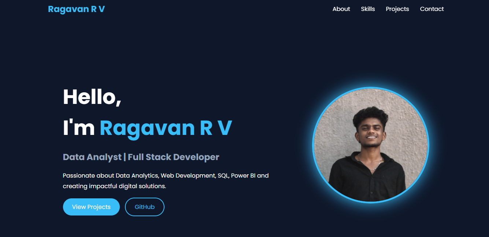
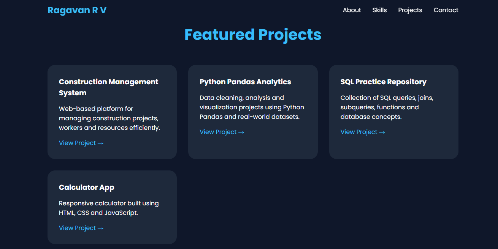
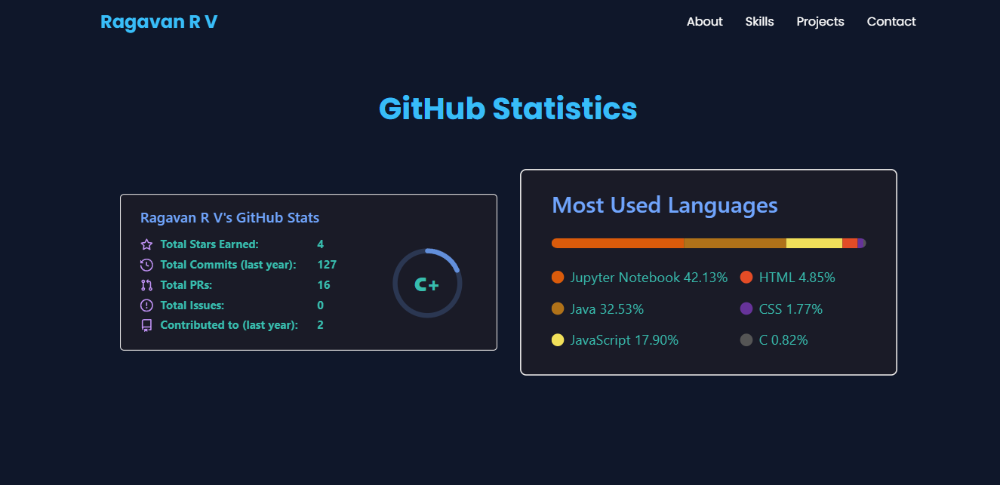

# 🌐 Personal Portfolio Website

Welcome to my Personal Portfolio Website! This portfolio showcases my skills, projects, certifications, and experience in Data Analytics, Python, SQL, Power BI, and Web Development. It serves as a central hub where recruiters, collaborators, and fellow developers can learn more about my work and professional journey. 

---

## 🚀 Live Demo

🔗 **Portfolio Website:(http://127.0.0.1:5500/portfolio.html)

---

## 📖 About

This portfolio highlights:

* 👨‍💻 About Me
* 🎓 Education
* 💼 Skills & Technologies
* 📊 Data Analytics Projects
* 🐍 Python Projects
* 🗄️ SQL Projects
* 📈 Power BI Dashboards
* 📜 Certifications
* 📬 Contact Information

The website is designed to provide a clean and professional overview of my technical expertise and project experience.

---

## 🛠️ Technologies Used

### Frontend

* HTML5
* CSS3
* JavaScript
* React.js

### Data Analytics

* Python
* Pandas
* NumPy
* Matplotlib
* Seaborn

### Database

* MySQL
* SQL

### Visualization

* Power BI
* Excel

### Version Control

* Git
* GitHub

---

## 📂 Featured Projects

### 📊 Online Store Sales Analysis

* Cleaned and analyzed sales datasets using Python and Pandas.
* Created insightful Power BI dashboards.
* Generated sales and customer behavior reports.

### 🐍 Python Pandas Projects

* Data Cleaning
* Data Manipulation
* Exploratory Data Analysis (EDA)
* CSV File Handling

### 🗄️ SQL Practice Repository

* SQL Queries
* Joins
* Subqueries
* Constraints
* Stored Procedures

### 📈 Power BI Dashboard

* Interactive dashboards
* KPI Tracking
* Sales Performance Analysis
* Business Insights

---

## 🎯 Skills

| Category        | Skills                       |
| --------------- | ---------------------------- |
| Programming     | Python, Java                 |
| Database        | MySQL, SQL                   |
| Data Analysis   | Pandas, NumPy                |
| Visualization   | Power BI, Excel, Matplotlib  |
| Web Development | HTML, CSS, JavaScript, React |
| Tools           | Git, GitHub, VS Code         |

---

## 📸 Portfolio Preview

### 🏠 Home Page


### 💼 Projects Section


### 📊 Dashboard Section


---

## ⚙️ Installation

Clone the repository:

```bash
git clone https://github.com/Ragav1102/PortFolio.git
```

Navigate to the project folder:

```bash
cd PortFolio
```

Install dependencies:

```bash
npm install
```

Run the project:

```bash
npm start
```

or

```bash
npm run dev
```

---

## 📬 Contact Me

* 📧 Email: [ragavanrv13@gmail.com](mailto:ragavanrv13@gmail.com)
* 💼 LinkedIn: [https://linkedin.com/in/your-profile](https://linkedin.com/in/your-profile)
* 🐙 GitHub: [https://github.com/Ragav1102](https://github.com/Ragav1102)

---

## ⭐ Support

If you like this project, please consider giving it a ⭐ on GitHub. It helps support my work and motivates me to create more projects.

---

## 📄 License

This project is licensed under the MIT License.

---

### 👨‍💻 Author

**Ragavan R V**

Aspiring Data Analyst | Python Developer | SQL Enthusiast | Power BI Learner

*"Turning data into meaningful insights and building solutions through code."* 🚀

[1]: https://ragav-portfolio.netlify.app/?utm_source=chatgpt.com "RAGAV PORTFOLIO"

